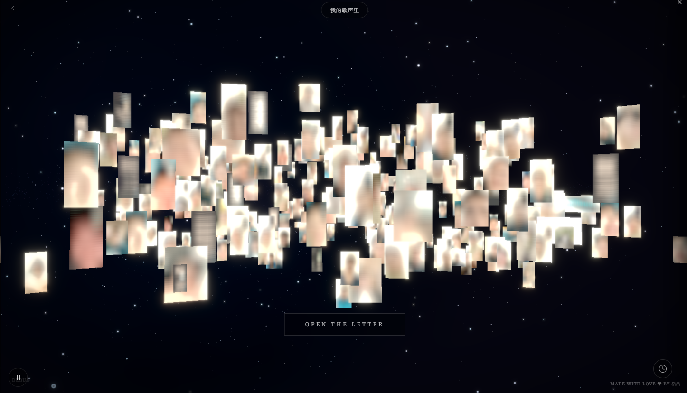
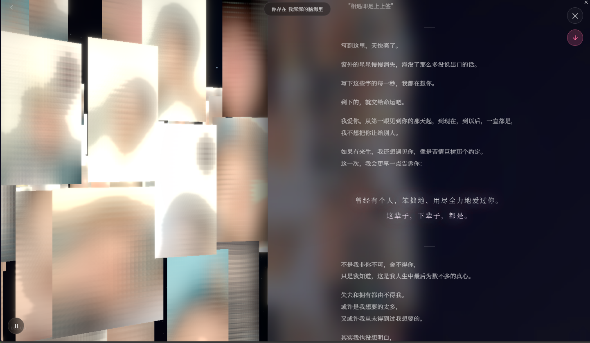

# 💌 Love Letter - 一份爱

<div align="center">


> 风记不住你的声音 我害怕幸福短暂 于是疯狂试探
> 
> 谢谢你的耐心和真心 你的真诚善良我细数我珍重

[快速开始](#-安装与运行) · [自定义配置](#️-配置说明)

</div>


效果图 [原图已加码]

---

## 📖 为什么要开源

> 2026年2月14日，今天是情人节。

我刚找你回来。此刻坐在电脑前，思绪万千。

这个项目从2025年12月开始制作。每个地方，都是独属于我们的记忆，那个回不去的曾经。

我记得你说"浩浩好厉害"的时候，我开心了好久。如今已然仿佛隔世。

同性恋本就不被祝福，能和你走到这里，我很荣幸，我很幸福。

可以说这个项目用尽了我毕生的爱，虽然技术不是很难，但是我想足够了。

意外总不知伴随着什么，情人节到了。

我也变成了过客。

我决定用这种独特的方式放下这段仅剩的温存。我决定开源了，因为：

**这是独属于我们的，如果这份爱可以被传播出去，我想我就是值得的**

也许有人也想为自己喜欢的人做点什么，但不知道从哪里开始。也许有人也经历过分离，想把回忆好好保存。也许有人只是想学习如何用代码表达情感。

我本人是一个学作曲的，最后的歌也是出自我手。可以一同欣赏下，不过那是属于他的哦。

> 下面的每一项都是精挑细选，爱需要足够的真诚

---

## 💝 珍藏的故事

<details>
<summary>点击展开我们的时间线</summary>

<br>

- **2025.03.04** - 你第一次送我东西，是一堆徽章，我最喜欢那个你的头像
- **2025.06.01** - 我教你写代码，你写了第一个 Minecraft 插件
- **2025.06.04** - 我快高考的时候，你鼓励我好好考试，你的笑容如此自信
- **2025.06.28** - 我给你做了第一张宣传图，你很开心，我也很开心
- **2025.07.04** - 我们第一次见面。阳光正好，我羞涩地蹲在墙角，你上来就抱住我

还有很多独属于我们的瞬间...

后来我们一起做项目，一起哭一起笑。

- **2025.11.07** - 一切都变了。你依然要带我重拾生活
- **2025.12.19** - 我决定做 MECT 了。我怕我会忘记你，也怕我会记起一切。我在代码里留了一段话："如果今天是晴天，请你打开窗吧，让阳光洒进来，因为我们曾沐浴同一束光芒。"
- **2026.02.14** - 情人节。我们已经分开了

</details>

---

## 🚀 安装与运行

### 前置要求

- Node.js 18+
- npm 或 pnpm

### 快速开始

```bash
# 克隆项目
git clone https://github.com/lythrilla/love-letter-react.git
cd love-letter-react

# 安装依赖
npm install

# 开发模式（Web）
npm run dev

# 构建（Web）
npm run build
```

### Tauri 桌面应用

```bash
# 开发模式
npm run tauri:dev

# 构建桌面应用
npm run tauri:build
```

构建完成后，可执行文件位于 `src-tauri/target/release/`

---

## ⚙️ 配置说明

### 1. 环境变量

复制 `.env.example` 为 `.env`（可选）

注意：当前版本的聊天功能使用本地存储（localStorage），不需要配置 API。`.env.example` 中的配置项已废弃。

### 2. 添加音乐

将背景音乐文件命名为 `bgm.mp3`，放入 `src/music/` 目录

### 3. 添加歌词

编辑 `src/assets/lyrics.lrc`，使用 LRC 格式，目前 《我的歌声里》 是精调的，受版权要求，这边不放出歌曲本体：

```lrc
[00:12.00]第一句歌词
[00:17.00]第二句歌词
```

### 4. 修改密码

默认密码：`123`

修改位置：`src/components/UI/PasswordScreen.tsx`

```typescript
if (password === '123') {  // 修改这里
  onSuccess()
}
```

### 5. 修改标题和字体

编辑 `index.html` 修改页面标题：

```html
<title>浩的世界下起小雨了哦</title>
```

项目使用的字体：
- `Noto Serif SC` - 中文衬线字体（Google Fonts）
- `Cinzel` - 英文衬线字体（Google Fonts）
- `Ma Shan Zheng` - 书法字体（本地，用于歌词显示）

如需更换字体，修改 `index.html` 中的 Google Fonts 链接和 `src/index.css` 中的字体引用。

### 6. 添加照片

将照片放入 `src/photos/` 目录，支持 `.webp` 格式

项目需要以下照片：
- 普通照片：任意数量（推荐大于200张），用于 3D 场景漂浮展示
- `baobao.webp`：人像照片，用于结尾画面展示

当前项目已有占位照片

### 7. 配置照片故事

编辑 `src/config/photoStories.ts`

```typescript
export const PHOTO_STORIES: Record<string, PhotoStory> = {
  'your-photo.webp': {
    title: '标题',
    content: '这里写你的故事',
    date: '2024.01.01',
    scale: 1.0,
  },
}
```

### 8. 配置彩蛋

编辑 `src/config/easterEggs.ts`

支持的彩蛋类型：
- `visit_count` - 访问次数触发
- `date_range` - 日期范围触发
- `anniversary` - 纪念日触发
- `time_range` - 时间段触发
- `long_absence` - 久未访问触发

### 9. 配置小说

编辑 `src/config/novels.ts`

```typescript
export const NOVELS: Novel[] = [
  {
    id: 'your-story',
    title: '你的故事',
    author: '作者',
    description: '简介',
    chapters: [
      {
        title: '第一章',
        content: '内容...',
      },
    ],
  },
]
```

### 10. 配置聊天触发照片

编辑 `src/config/chatTrigger.ts`

```typescript
// 修改此值来更改触发聊天窗口的照片
export const CHAT_TRIGGER_PHOTO = 'IMG_20250901_002915.webp'
```

当用户点击指定的照片时，会自动打开聊天窗口。

### 11. 访问聊天页面

除了点击照片触发，也可以直接访问聊天页面：

```
# 作为 A 用户（默认）
http://localhost:5173/#/chat

# 作为 B 用户
http://localhost:5173/#/chat?me=B
```

聊天消息存储在浏览器的 localStorage 中，双方共享同一设备时可以看到对方的消息。

### 12. 生成占位符图标

如果需要重新生成应用图标（带心形的渐变占位符）：

```bash
# 生成所有尺寸的 PNG 图标
node scripts/generate-icon-placeholders.mjs

# 使用 Tauri CLI 生成 .ico 和 .icns 文件
npm run tauri icon src-tauri/icons/icon.png
```

生成的图标包含：
- 渐变背景（紫色到粉色）
- 半透明装饰圆圈
- 中心白色心形图案

如需自定义图标，可以替换 `src-tauri/icons/icon.png`（512x512），然后运行 `npm run tauri icon` 命令。

---

## 🛠️ 技术栈

### 前端

- **框架**: React 19 + TypeScript 5
- **3D 渲染**: Three.js + React Three Fiber
- **3D 工具**: @react-three/drei, @react-three/postprocessing
- **动画**: GSAP
- **状态管理**: Zustand
- **样式**: Tailwind CSS 4
- **构建工具**: Vite 7

### 桌面应用

- **框架**: Tauri 2
- **语言**: Rust

### 其他

- **字体**: Noto Serif SC, Cinzel, Ma Shan Zheng
- **图片格式**: WebP
- **图片处理**: Sharp, heic-convert

---

## 📁 项目结构

```
love-letter-react/
├── src/
│   ├── components/          # 组件
│   │   ├── Chat/           # 聊天功能
│   │   ├── Letter/         # 信件组件
│   │   ├── Scene/          # 3D 场景
│   │   └── UI/             # UI 组件
│   ├── config/             # 配置文件
│   │   ├── chatTrigger.ts  # 聊天触发配置
│   │   ├── easterEggs.ts   # 彩蛋配置
│   │   ├── novels.ts       # 小说配置
│   │   └── photoStories.ts # 照片故事配置
│   ├── photos/             # 照片资源
│   ├── store/              # 状态管理
│   └── utils/              # 工具函数
├── src-tauri/              # Tauri 桌面应用
├── scripts/                # 工具脚本
│   ├── generate-placeholder.html  # 占位图生成工具
│   └── generate-placeholder.py    # Python 占位图生成
└── public/                 # 静态资源
```

---

## 🎨 自定义主题

项目使用 CSS 变量，可以轻松自定义主题：

```css
:root {
  --bg-dark: #050508;
  --text-light: rgba(255, 255, 255, 0.8);
  --accent-color: #667eea;
}
```

---

## 📄 开源协议

MIT License

你可以自由地使用、修改和分发这个项目，但请保留原作者 Lythrilla 信息。

---

## 💭 写在最后

谢谢你出现在我的生命里。

我会好好生活，好好加油。

如果有一天，你想起我了，这里的灯还亮着。

> 代码会 legacy，但 Love 不会。

双人成行里有一句话：

> "我一生最棒的事情就是寻到了你。"

对我来说也是。

> "山河远阔，人间烟火，无一是你，无一不是你。"

---
浩的世界下起小雨了哦
<div align="center">

**Made with Love ♥ by 浩浩**

*2026.02.14*

</div>
